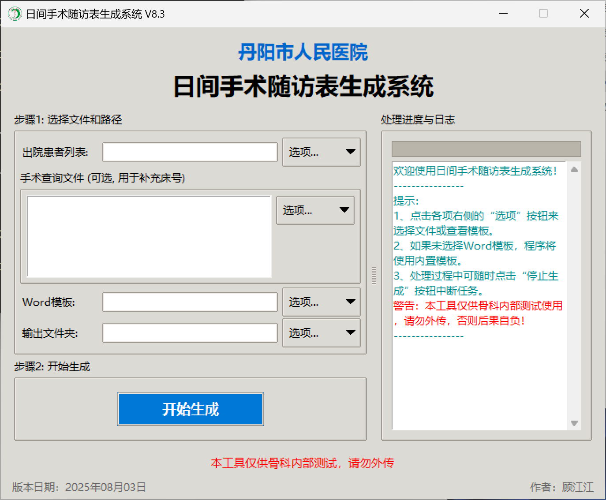

# Day Surgery Form Automator
# (日间手术随访表生成系统)

[](https://www.python.org/)
[]()
[](https://opensource.org/licenses/MIT)

这是一款功能强大且用户友好的医疗文档自动化工具，专为简化“日间手术随访表”的生成流程而设计。**V8.x 版本对项目代码进行了全面的模块化重构，将原先单一的脚本拆分为独立的逻辑 (`core`)、界面 (`gui`)、配置 (`config.py`) 和工具函数 (`utils.py`) 模块，大幅提升了代码的可读性与可维护性。**


*<p align="center">软件截图</p>*

### 更新日志：[CHANGELOG](./docs/changelog.md)

---

## ✨ 核心功能

### 智能数据处理引擎
* **零依赖内核**：全面采用 Python 内置的 `SQLite` 内存数据库进行所有数据处理，**无需安装任何额外的第三方数据处理库**（如Pandas），从根本上解决了程序打包后体积过大的问题，实现了极致轻量化。
* **多文件自动合并**：支持一次性拖入或选择多个`手术查询文件`。程序会自动读取所有文件，将其中的床号信息整合进一个统一的数据库中，轻松应对数据分散在不同表格中的复杂情况。
* **强大的数据清洗与匹配**：内置先进的数据清洗算法，能够自动处理两个Excel文件中因格式差异（如住院号`0123` vs `123`）或隐藏字符（如不可见空格）导致的数据不一致问题，极大地提高了床号匹配的成功率。
* **智能标题行检测**：程序能自动分析并识别Excel文件中真正的标题行在第几行，完全无视文件顶部的任何大标题、合并单元格或空行，确保数据读取的高度准确性。
* **全自动日期处理**：彻底告别手动选择“主导月份”的繁琐操作。程序会为每一位患者自动提取其真实的“出院日期”，并以此为基准，精确生成文件名和文档内容（如随访日期），实现完全自动化的精确处理。
* **精准失败提醒**：独有的智能提醒机制，只针对**真正符合“日间手术”条件的患者**进行床号匹配失败的汇总提醒。程序会自动过滤掉所有非日间手术的无关信息，让问题定位更快速、更精准。

### 现代化的用户体验
* **全面跨平台兼容**：完美支持 Windows、macOS 和 Linux 操作系统，自动识别并适配不同系统的窗口透明度与高分屏特性，真正实现一次编写，多端运行。
* **流畅不卡顿的多线程架构**：所有耗时的文件读写、数据解析和文档生成任务，均在独立的后台线程中执行。这确保了图形用户界面（GUI）在处理过程中**始终保持流畅响应**，用户可以随时与界面交互，体验绝不卡顿。
* **专业的双通道日志系统**：
    * **UI界面日志**：在界面右侧提供带颜色区分（提示/警告/错误）的滚动日志框，实时、直观地显示处理进度和关键信息。
    * **本地文件日志**：同时，在程序目录下的 `logs/` 文件夹中自动生成详细的 `app_runtime.log` 文件，记录了包括调试信息在内的所有操作，极大地方便了问题的追溯与排查。
* **完全可控的任务流程**：在文档生成期间，用户可以随时点击“停止生成”按钮。程序会安全地中断当前任务，并妥善处理已完成的部分，给予用户完全的控制权。
* **丰富的交互设计**：
    * **日志管理**：支持在UI日志区域右键单击，弹出菜单以快速**清空**或**导出**当前日志为`.txt`文件。
    * **自适应高分屏**：自动识别高DPI屏幕（如Retina屏），并等比例缩放整个窗口和所有控件，确保在任何显示器上都获得清晰、锐利的视觉效果。
    * **专业启动画面**：支持自定义启动画面，并在主程序初始化完成后无缝切换至主界面，提升了程序的专业感。

### 灵活的配置与高可维护性
* **高度模块化的软件架构**：项目代码被全面重构，精心拆分为独立的界面(`gui`)、核心逻辑(`core`)、配置(`config.py`)等模块，并采用了`控制器-处理器`的设计模式。这种清晰的结构极大地提高了代码的可读性和可维护性，便于未来的功能扩展。
* **一站式中央配置系统**：所有关键参数，包括日间手术天数定义、Excel列名与程序字段的映射关系、Word模板占位符，乃至日志系统的开关，全部集中在 `src/config.py` 这一个文件中。未来任何业务规则的调整，都只需修改此文件，**无需触碰任何核心代码**。
* **完善的内置模板管理**：
    * 程序内置了标准的Excel和Word模板，用户可通过UI界面随时点击“查看模板”来了解所需的数据格式。
    * 当用户未指定外部Word模板时，可以选择调用**内置模板**，确保了开箱即用的便利性。
    * **安全模板预览**：为了保护原始模板文件的完整性，当用户查看模板时，程序会自动创建一份临时的**只读副本**供用户查看，从根本上杜绝了原始模板被意外修改的风险。

## 📂 项目结构

```
.
├── LICENSE                   # 许可协议
├── README.md                 # 本说明文件
├── docs/                     # 存放文档和相关资源
│   ├── BUILD_GUIDE.md        # 程序打包指南
│   ├── changelog.md          # 更新日志
│   └── images/               # 文档用图片 (如截图)
│       ├── icons/            # 可选图标
│       └── screenshots/      # 软件截图
├── source/                   # 源代码目录
├── main.py               # 🚀 主程序入口
├── requirements.txt      # 📦 依赖列表
├── assets/               # 🎨 存放资源文件
│   ├── app.ico           # 程序图标
│   └── splash.png        # 启动画面
├── templates/            # 📂 内置模板文件夹
│   ├── 出院患者列表模板.xls
│   ├── 手术查询模板.xlsx
│   └── 日间手术随访登记表模板.docx
└── src/                  # 模块目录
    ├── __init__.py       # 将src声明为可导入的包
    ├── config.py         # 全局配置
    ├── logger_setup.py   # 日志系统初始化
    ├── temp_manager.py   # 临时文件管理器
    ├── template_handler.py   # 内置模板管理器
    ├── utils.py          # 工具函数
    ├── core/             # 核心逻辑模块
    │   ├── __init__.py
    │   ├── logic.py      # 核心业务编排
    │   └── modules/      # 核心功能子模块
    │       ├── __init__.py
    │       ├── db_manager.py     # 数据库管理
    │       ├── doc_writer.py     # 文档生成
    │       └── excel_reader.py   # Excel读取
    └── gui/              # GUI界面模块
        ├── __init__.py
        ├── app_controller.py   # GUI应用控制器 (原main_app.py)
        ├── handlers.py         # GUI事件处理器
        ├── logger_handler.py   # 自定义UI日志处理器
        ├── tooltip.py          # 悬停提示工具
        ├── ui_builder.py       # GUI界面布局
        └── ui_components.py    # GUI可复用组件
```

## 🚀 安装与运行

详细的安装、运行及打包说明，请参考： **[自动化程序编译与打包指南](./docs/BUILD_GUIDE.md)**


## 🔧 配置说明

本程序的所有关键配置项均位于 `src/config.py` 文件中，您可以根据需要进行修改：

### 1. `UI_CONFIG` (界面配置)
这部分控制程序的外观和所有显示的文本。

* `app_info`: 定义了程序的基本信息，如 `title` (窗口标题), `version` (版本号), `author` (作者名) 和 `build_date` (版本日期)。
* `fonts`: 设置程序中不同位置（如标题、正文、按钮）的字体、大小和样式。
* `texts`: 管理界面上所有的静态文本，例如欢迎语、提示信息、警告语和“关于”对话框的内容。
* `colors`: 定义了日志区域不同级别信息（如`INFO`, `WARNING`, `ERROR`）的显示颜色。

### 2. `CONFIG` (核心逻辑配置)
这部分控制程序的实际数据处理行为。

* `day_surgery_max_days`: **业务规则**。用于定义“日间手术”的最大住院天数，程序将只筛选住院天数小于等于此值的患者。
* `output_filename_format`: **文件名格式**。允许您使用 `{姓名}`, `{住院号}`, `{出院年月}` 等占位符，高度自定义生成的Word文档的文件名。
* `column_mapping`: **核心映射**。这是最重要的配置项，它建立了程序内部字段名（如 `name`）与您Excel文件中实际列名（如 `姓名`）之间的对应关系。如果您的Excel列名有变，只需修改此处的中文部分即可，无需改动任何代码。
* `required_patient_cols` / `required_surgery_cols`: 定义了在主文件和手术查询文件中**必须存在**的列，程序会依据这些列来智能定位数据起始行。
* `template_placeholders`: 定义了Word模板中的占位符（如 `{{姓名}}`）与 `column_mapping` 中字段的对应关系。

### 3. `LOGGING_CONFIG` (日志系统配置)
这部分控制程序日志的生成方式。

* `enable_file_logging`: **日志开关**。这是一个布尔值 (`True` 或 `False`)。设置为 `True` 时，程序每次运行都会在 `logs/` 目录下生成详细的 `app_runtime.log` 文件；设置为 `False` 则不生成，可以保持目录整洁。
* `log_level`: 定义日志的详细级别。`INFO` 级别会记录关键信息，而 `DEBUG` 级别会记录更详细的调试信息，方便排查问题。
* `log_max_bytes` 和 `log_backup_count`: 用于控制日志文件的自动分割和轮换，防止单个日志文件过大。

## 👨‍💻 贡献者

* **原始作者与核心需求**: 顾江江
* **重构与AI辅助开发**: Google AI

## 📜 许可协议

本项目采用 [MIT License](https://opensource.org/licenses/MIT) 开源协议。